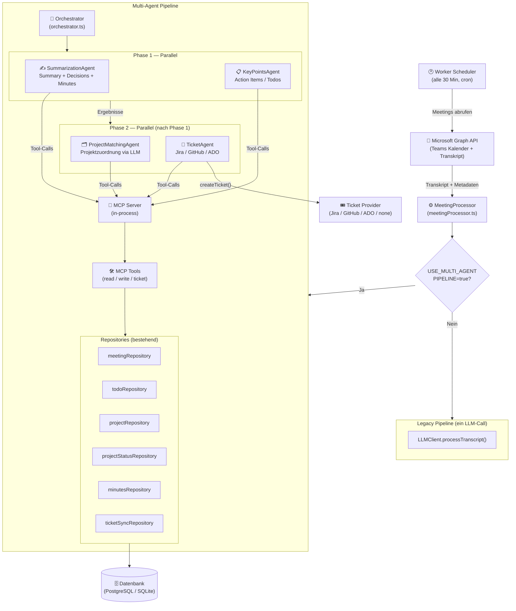

# Multi-Agent Pipeline — Architektur & Komponenten

Dieses Dokument beschreibt den Aufbau der MCP-basierten Multi-Agent-Pipeline und erklärt, wie alle Komponenten zusammenarbeiten. Es richtet sich an Entwickler, die das System verstehen, erweitern oder debuggen möchten.

---

## Was ist MCP?

**Model Context Protocol (MCP)** ist ein offenes Protokoll, das KI-Agenten eine standardisierte Schnittstelle zu Werkzeugen (Tools) und Daten bietet. In diesem Projekt wird MCP **in-process** verwendet: Server und Client laufen im gleichen Node.js-Prozess und kommunizieren über einen Speicher-internen Transport — ohne Netzwerk-Overhead und ohne separaten Dienst.

> **Analogie:** MCP verhält sich ähnlich wie eine REST-API, nur dass die Aufrufer KI-Agenten sind und der "Server" direkt in der gleichen Anwendung läuft.

---

## Prozessdiagramm

Das folgende Diagramm zeigt den vollständigen Ablauf vom Worker-Cron-Job bis zur persistierten Datenbank.



---

## Komponenten im Detail

### 1. Worker Scheduler (`src/worker/scheduler.ts`)

Der Einstiegspunkt des Hintergrundprozesses. Läuft als separater Node.js-Prozess (`npm run worker`), gesteuert durch einen Cron-Job (Standard: alle 30 Minuten).

**Verantwortlichkeiten:**
- Alle Nutzer mit Microsoft-Konto laden
- Für jeden Nutzer: neue Meetings seit letztem Checkpoint abrufen (Delta-Sync)
- `MeetingProcessor.processMeeting()` aufrufen
- Checkpoint aktualisieren

**Datenfluss:**
```
Graph API → [Meeting-Metadaten + Transkript] → MeetingProcessor
```

---

### 2. MeetingProcessor (`src/agent/meetingProcessor.ts`)

Das zentrale Bindeglied zwischen Worker und KI-Schicht. Hier findet die Weggabelung zwischen Legacy- und Multi-Agent-Pipeline statt.

```typescript
if (process.env.USE_MULTI_AGENT_PIPELINE === 'true') {
  // → MeetingPipelineOrchestrator
} else {
  // → LLMClient.processTranscript() (ein einzelner LLM-Call)
}
```

**Der Processor übernimmt außerdem:**
- Meeting-Datensatz anlegen/aktualisieren (Upsert mit Composite-Key `meetingId + startTime`)
- Indexierungs-Locks verwalten (verhindert paralleles Verarbeiten desselben Meetings)

---

### 3. MCP Server (`src/mcp/server.ts`)

Der MCP-Server stellt alle Werkzeuge (Tools) bereit, die Agenten aufrufen können. Er ist **zustandslos** — ein Server, der für alle Agenten einer Pipeline-Ausführung geteilt wird.

```
createMcpServer(deps) → McpServer
```

**Tool-Gruppen:**

| Gruppe | Datei | Tools |
|---|---|---|
| **Read** | `tools/readTools.ts` | `get_meeting_context`, `get_transcript_segment`, `list_tenant_projects`, `get_project_by_name`, `list_recent_todos` |
| **Write** | `tools/writeTools.ts` | `save_summary`, `save_minutes`, `save_todos`, `save_project_statuses`, `assign_todo_project`, `find_or_create_project` |
| **Ticket** | `tools/ticketTools.ts` | `check_ticket_exists`, `create_ticket`, `find_assignee` |

**Jedes Tool:**
1. Empfängt typsichere Parameter (Zod-Schema)
2. Delegiert an das passende Repository oder den Ticket-Provider
3. Gibt ein JSON-kodiertes Ergebnis zurück

---

### 4. MCP Client (`src/mcp/client.ts`)

Verbindet den Orchestrator mit dem MCP-Server über einen **In-Memory-Transport** (kein HTTP, kein Socket).

```typescript
const client = await createInProcessMcpClient(server)
// → Ein verbundener Client, den alle Agenten nutzen
```

Der Helper `callTool<T>(client, name, args)` kapselt den rohen Tool-Call und parst das JSON-Ergebnis typsicher.

**Warum In-Process?**
- Kein Netzwerk-Overhead pro Tool-Call (~0ms statt 1–5ms)
- Kein separater Container/Service notwendig
- Später problemlos in einen externen MCP-HTTP-Service extrahierbar

---

### 5. Orchestrator (`src/agents/orchestrator.ts`)

Steuert die Ausführungsreihenfolge der Agenten in zwei Phasen.

```
Phase 1 (parallel):  SummarizationAgent ‖ KeyPointsAgent
                              ↓
Phase 2 (parallel):  ProjectMatchingAgent ‖ TicketAgent
```

**Wichtige Eigenschaften:**
- Nutzt `Promise.allSettled()` — ein fehlschlagender Agent bricht nicht die anderen ab
- Jeder Fehler wird in `AgentPipelineResult` dokumentiert (kein stiller Datenverlust)
- Gibt `AgentPipelineResult` zurück mit Einzelergebnissen, Latenz und Token-Verbrauch

---

### 6. Die vier Agenten

#### SummarizationAgent (`src/agents/summarize/`)
- **Aufgabe:** Executive Summary + Key Decisions + Meeting Minutes (mehrsprachig)
- **LLM-Calls:** 1 (Temperature 0.2)
- **Nutzt Tools:** `save_summary`, `save_minutes`
- **Phase:** 1 (parallel)

#### KeyPointsAgent (`src/agents/keypoints/`)
- **Aufgabe:** Action Items / Todos extrahieren, Confidence-Scoring anwenden
- **LLM-Calls:** 1 (Temperature 0.1 — möglichst deterministisch)
- **Nutzt Tools:** `save_todos`
- **Phase:** 1 (parallel)
- **Kritisch:** Schreibt Todos in die DB bevor Phase 2 startet → liefert IDs für TicketAgent

#### ProjectMatchingAgent (`src/agents/project/`)
- **Aufgabe:** Erkennt via LLM, welche bekannten Projekte im Meeting besprochen wurden und in welchem Status
- **LLM-Calls:** 1 (Projektliste aus DB wird in den Prompt injiziert)
- **Nutzt Tools:** `list_tenant_projects`, `save_project_statuses`, `assign_todo_project`
- **Phase:** 2 (empfängt Todo-Liste aus Phase 1)
- **Verbesserung ggü. Legacy:** Semantisches LLM-Matching statt fragiler Token-Überlappung

#### TicketAgent (`src/agents/ticket/`)
- **Aufgabe:** Für jeden Todo prüfen ob Ticket existiert, sonst anlegen
- **LLM-Calls:** 0 — reine Tool-Call-Schleife
- **Nutzt Tools:** `check_ticket_exists`, `create_ticket`, `find_assignee`
- **Phase:** 2 (parallel mit ProjectMatchingAgent)
- **Fehlerbehandlung:** Pro Todo isoliert — ein Jira-Fehler stoppt nicht die anderen

---

## Datenfluss durch die Pipeline

```
Transkript + Meeting-Metadaten
        │
        ▼
┌───────────────────────────────────────────────────────┐
│  Phase 1 (parallel)                                   │
│                                                       │
│  SummarizationAgent          KeyPointsAgent           │
│  ├─ LLM-Call                 ├─ LLM-Call              │
│  ├─ save_summary ──► DB      ├─ save_todos ──► DB     │
│  └─ save_minutes ──► DB      └─ returns: [todoIds]    │
└──────────────────────┬────────────────────────────────┘
                       │ todoIds übergeben
                       ▼
┌───────────────────────────────────────────────────────┐
│  Phase 2 (parallel)                                   │
│                                                       │
│  ProjectMatchingAgent        TicketAgent              │
│  ├─ list_tenant_projects     ├─ check_ticket_exists   │
│  ├─ LLM-Call mit Projektlist ├─ create_ticket ──► Ext.│
│  ├─ save_project_statuses    └─ ticketSync ──► DB     │
│  └─ assign_todo_project ──► DB                        │
└───────────────────────────────────────────────────────┘
        │
        ▼
AgentPipelineResult (Zusammenfassung aller Ergebnisse + Fehler)
```

---

## Fehlerbehandlung

Die Pipeline folgt dem Prinzip **"Fail Isolated, Never Silent"**:

```typescript
// Orchestrator nutzt allSettled — nie allRejected
const [summarizationResult, keyPointsResult] = await Promise.allSettled([
  summarizationAgent.run(...),
  keyPointsAgent.run(...)
])
```

| Szenario | Verhalten |
|---|---|
| SummarizationAgent schlägt fehl | KeyPoints, Projects, Tickets laufen trotzdem |
| KeyPointsAgent schlägt fehl | ProjectMatching und Ticket Agent bekommen leere Listen (laufen ohne Todos) |
| TicketAgent schlägt fehl | Todos und Summary sind bereits gespeichert, nur Ticket-Sync fehlt |
| Einzelner Ticket-Call schlägt fehl | Nur dieser Todo bekommt `status: 'failed'` in TicketSync — die anderen laufen weiter |

Alle Fehler erscheinen in `AgentPipelineResult.phases[agent].reason` und werden geloggt.

---

## Konfiguration

| Umgebungsvariable | Beschreibung | Default |
|---|---|---|
| `USE_MULTI_AGENT_PIPELINE` | `true` aktiviert die neue Pipeline | `false` (Legacy) |
| `OPENAI_API_KEY` | OpenAI API Key | — |
| `AZURE_OPENAI_ENDPOINT` | Azure OpenAI Endpoint (statt OpenAI) | — |
| `AZURE_OPENAI_DEPLOYMENT` | Azure OpenAI Deployment-Name | — |
| `AZURE_OPENAI_API_KEY` | Azure OpenAI API Key | — |
| `OUTPUT_LANGUAGES` | Comma-separated Sprachen für Minutes | `de,en` |
| `WORKER_INTERVAL_MINUTES` | Polling-Intervall des Workers | `30` |
